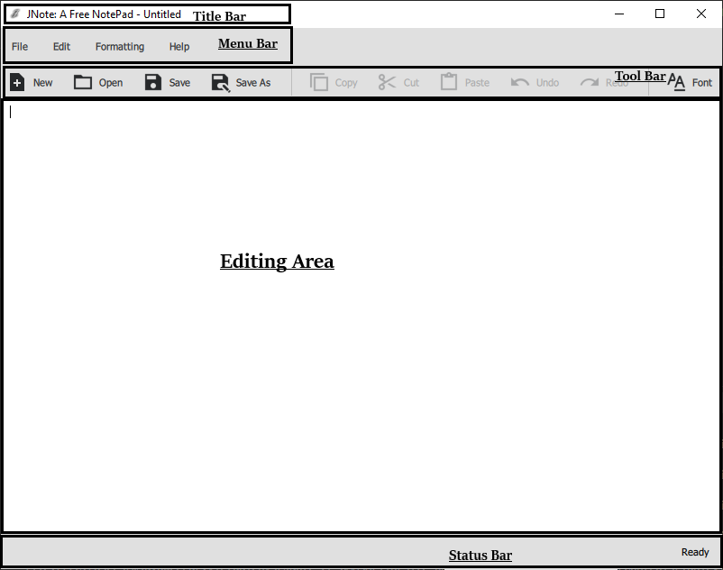

# First Steps With JNote

In this tutorial, you will learn how to to the most basic stuff with JNote. For help regarding installation, please read [The Getting Started Guide](getting-started.md).

## Using JNote

To start using JNote, fire it up by double clicking `JNote.exe` (Windows) or `JNote.app` (Mac). 

On Linux, execute `path/to/JNote/JNote` in the Terminal. Example - `~/opt/JNote/JNote`.

After successfuly starting JNote, you will see the JNote GUI (see below).

### Step 1: Create a New Document

To use JNote properly, you should create a new document. You can do so by clicking 'File' and then 'New` in the Menu Bar, or clicking 'New' in the Tool Bar, or simply pressing <kbd>Ctrl</kbd> + <kbd>N</kbd>! For more about keyboard shortcuts, see [Keyboard Shortcuts](keyboard-shortcuts.md).
