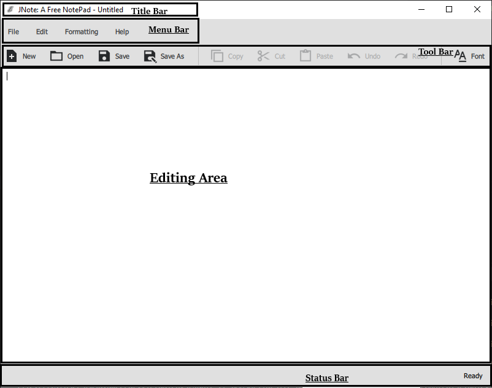

# First Steps With JNote

In this tutorial, you will learn how to to the most basic stuff with JNote.
For help regarding installation, please read [The Getting Started Guide](getting-started.md).

## Using JNote

To start using JNote, fire it up by double clicking `JNote.exe` (Windows) or `JNote.app` (Mac). 

On Linux, execute `path/to/JNote/JNote` in the Terminal. Example - `~/opt/JNote/JNote`.

After successfully starting JNote, you will see the JNote GUI (see below).

### Step 1: Create a New Document

To use JNote properly, you should create a new document. You can do so by clicking 'File' and then 'New` in the Menu Bar, or clicking 'New' in the Tool Bar, or simply pressing <kbd>Ctrl</kbd> + <kbd>N</kbd>!
For more about keyboard shortcuts, see [Keyboard Shortcuts](keyboard-shortcuts.md).

After successfully creating a new document, the text area empties (if there were any text inside) and the message "New Document Created" appears in the Status Bar.
Now you can type any text you want! Let's type "Hello!!".

### Step 2: Save your work

For this example we will create a new folder called `JNote-Example` in your `Documents` folder.
You can find the `Documents` folder in `~/Documents` for Mac and Linux, and `C:\Users\username\Documents` for Windows.

After editing the new document you just created, you can save it in a new file by clicking 'File' and then 'Save as', or just click 'Save as' in the Tool Bar. 
You can also press <kbd>Ctrl</kbd> + <kbd>Shift</kbd> + <kbd>S</kbd>.

Then a File Dialog appears asking you to choose a location and a filename for your file.
Choose the `JNote-Example` folder and type myfile.txt for the filename.
Finally, Hit Save!

A file with the name `myfile.txt` should appear in the `JNote-Examples` folder.

### Step 3: Closing JNote

Now that we have done enough with JNote, we have to close it.
You can do so by clicking the '&times;' button in the Title Bar, or click 'File' and then 'Exit' in the Menu Bar.

## Troubleshooting JNote

For troubleshooting JNote, refer to the [Troubleshooting Guide](troubleshooting.md).

## All Features

Now that you know the most basic features of JNote, check out [All the Features](all-features.md).